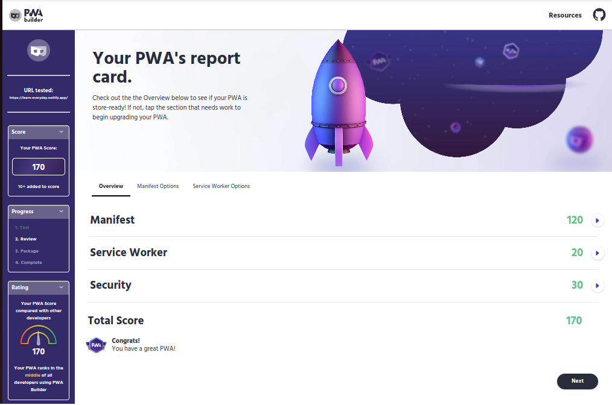

The <u>PWA Summit 2022</u> was held on the 5th and 6th of October 2022. This was also held online like last year but was a bit different. This year featured improvements in client-side storage, tools for building PWAs, performance, and how these improvements have been implemented in building popular products and services we use today.

<p>&nbsp;</p>

## CLIENT-SIDE STORAGE

Progressive Web Apps (PWAs) can use different types of client-side storage, including IndexedDB, WebSQL (now deprecated), and the local and session storage APIs. These storage options allow PWAs to store data locally on the user's device so that the app can work offline and improve performance.

To store a large amount of data on the client side that can be searchable, you need IndexedDB.

### IndexedDB

IndexedDB is based on a transactional database model, using indexes for faster searching. Most people do not like its event base API syntax and bother about cross-browser support, but these can be solved with wrappers like IDB and Dexies.js.

When building PWAs, one popular strategy is IndexedDB with cache storage; IndexedDB for metadata, server responses, captions, and video data and Cache Storage for HTML, CSS, JS Scripts, and Images. Depending on what you are building, Background Sync API can also be used in addition to deferring actions until the application has access to a stable Internet connection.

IndexedDB is not perfect and has some limitations. One of the limitations is data persistence. Data persistence issues in IndexedDB can occur from any of the following.

- When browsers are configured to clear data on close (libraries, incognito mode, etc),

- When a user manually clears browser data,

- Eviction when disk space is low especially on mobile devices.

A solution to this is [Persistent Storage](https://web.dev/persistent-storage). It is supported in many modern browsers. This works by marking your entire site's storage as persistent to prevent the browser from deleting your data. This can be implemented like so.

```js
if (navigator.storage && navigator.storage.persist) {
  const isPersisted = await navigator.storage.persist()
  console.log(`Persisted storage granted: ${isPersisted}`)
}
```

As stated in the talk by [Jeremy Scheff](https://www.youtube.com/watch?v=tEOzwbvmTpA&list=PLdwe-qCygjtFuWAeFoPI6-_9FKt2BRLh3), Persistent Storage does not work straight-forward as expected, it also has some challenges.

- Browsers (like in Chrome) may use heuristics to enable or skip enabling persistent storage. Even if you prompt the user to enable persistent storage, it might not work. And this might be confusing for the user.

- It only helps with eviction. Persistent storage does not work if you manually clear your browser data.

- It may not completely help with eviction. Persistence storage might disable itself sometimes for some unknown reasons.

### Origin Private File System (OPFS)

This is an API for high-performance file system access. It hopes to solve the persistence storage problem with IndexedDB. This means your data persists even if the user manually clears browser data or closes a browser in incognito mode. It is a new technology supported in Chrome and Safari for now. Currently the Chrome dev and SQLite team are working on a library for running SQLite on OPFS.

<p>&nbsp;</p>

## POPULAR TOOLS FOR PWA DEVELOPMENT

### PWA Builder

This is an open-source tool that help developer build high-quality PWA. It allows developers to create and configure a PWA using pre-built templates and options.

The PWABuilder platform helps:

- Start a new app with PWA starter,

- Build your app with the help of PWABuilder Studio following its documentation,

- Publish your app to the web with PWABuilder studio,

- Package your app for the app stores with [pwabuilder.com](https://www.pwabuilder.com/)

PWAbuilder scans your PWA for missing parts like manifest, service worker, and security. It then provides a report card on your PWA to see the level of it completeness.

_A PWA Builder report card of my [LearnEveryday](https://learn-everyday.netlify.app/) PWA._



### Developer Tools

We all use developer tools. They are part of browser tools used to test and optimize the PWA for performance and compatibility with different devices. Some developer tools provide tools to audit a PWA's performance and identify areas for improvement. For example Lighthouse in Chrome developer tools.

### Workbox

These are a set of libraries and modules that can be used to add offline support and other PWA features to web applications. Workbox can be particularly useful in maintaining your service worker and cache storage logic as your PWA grows.

<p>&nbsp;</p>

## PERFORMANCE AND CAPABILITIES

The <u>Project Fugu</u> effort has been working to improve capabilities; bridging the gap between native and web applications. <u>Intel</u> as part of the project fugu team has been working on improving capabilities and providing the performance of web apps close to or better than native apps by efficient use of device hardware and chipsets. These can be seen in new and upcoming APIs to improve performance.

### WebAssembly

WebAssembly provides a way to run code written in multiple languages on the web at near-native speed. Taking advantage of the fact that it can run alongside JavaScript, its improved speed and efficiency (like fast CPU execution), complex PWA can now be built using languages like C++ and Rust, then complied to WebAssembly potentially resulting in faster loading times and better overall performance.

### WebGL

Web Graphics Library allows developers to create complex 3D graphics applications that run in the browser without the need for additional plugins or downloads. This makes it possible to create rich, immersive 3D experiences that run directly in the browser and can be accessed by anyone with a web-enabled device. WebGL has been around for a while and is supported by all major web browsers.

### WebGPU

WebGPU is intended to replace WebGL. It provides developers with more control and flexibility over the graphics hardware in the browser. WebGPU is still in the early stages of development, and is already showing amazing numbers; it is 3.7 times faster than WebGL. It is not yet widely supported by major web browsers but support is slowly building up.

### Web Neural Network

A web neural network is a type of artificial neural network that is designed to run in a web browser. A web neural network is typically implemented using JavaScript and can be run directly in the browser, without the need for additional plugins or downloads. This allows developers to create and deploy sophisticated machine-learning applications that can be accessed from any web-enabled device.

### Compute Pressure API

This is an experimental API for reacting to changes in CPU use. Imagine you are doing a lot of things with your computer, it might be warm or you notice increased fan speed. This shows the CPU is stressed or under pressure and does not give pleasant results (For example, you are not able to type on a simple notepad). The web apps that use this API can enable or disable heavyweight features in response to these observations or pressure. It's a feedback mechanism that unlocks new doors for adaptive behavior, which can in turn lead to smoother, cooler experiences across a range of hardware devices.

<p>&nbsp;</p>

And this is a summary of what I learned from the PWA Summit 2022. If you want to find out more, you can check out the different talks from the [PWA summit website](https://pwasummit.org/).
