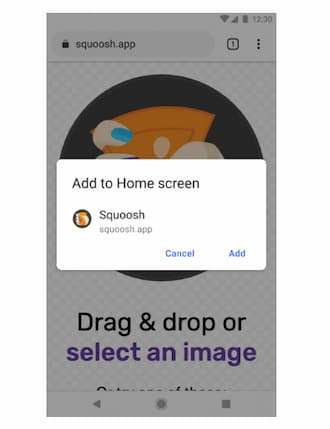
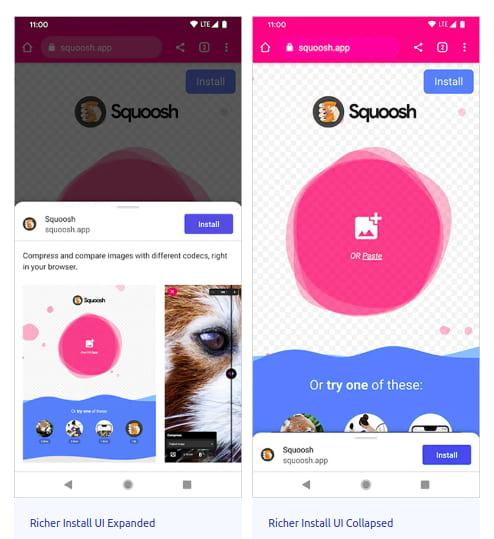
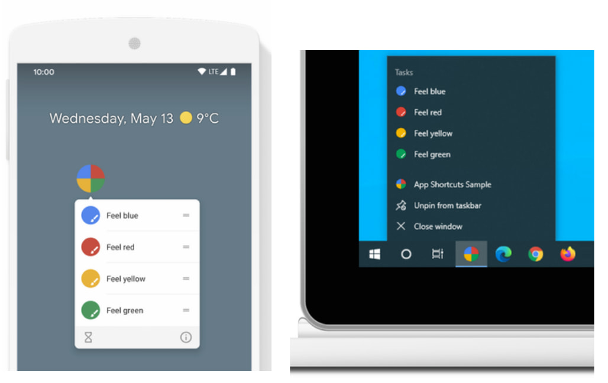
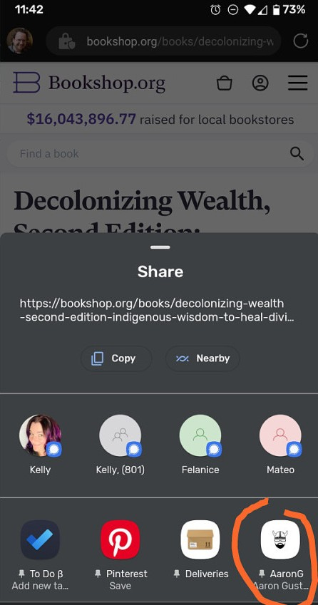
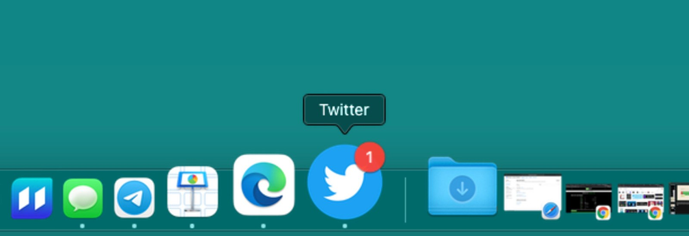
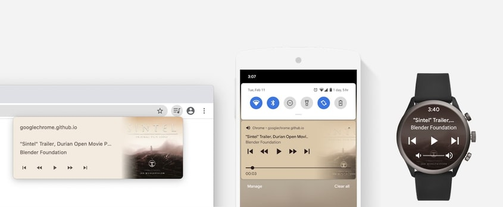
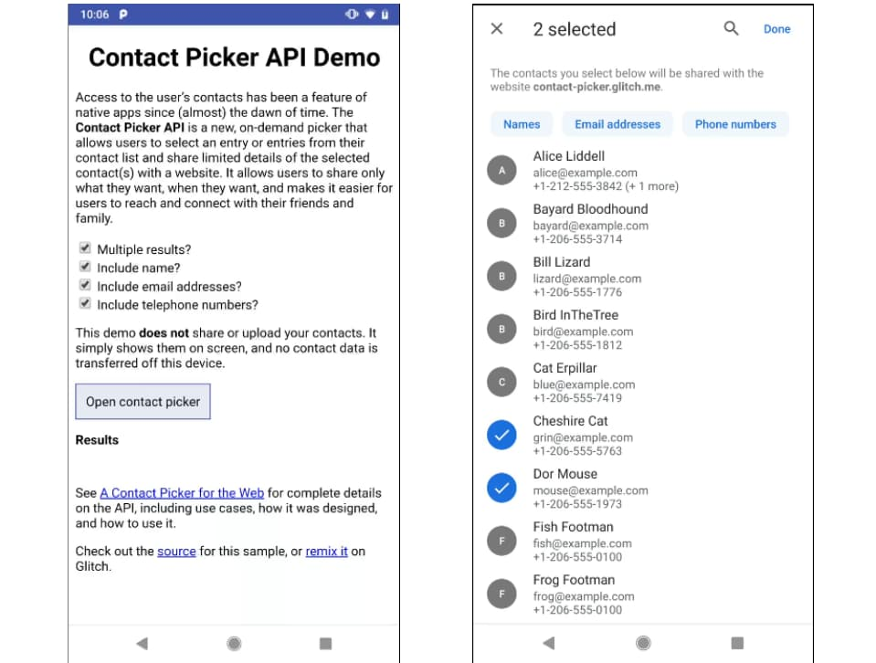

I first heard about Progressive Web Apps (PWA) in 2016 at the PWA Sub-Saharan Africa Roadshow in Lagos Nigeria. At the end of the conference, I remember chatting with some of the attendees about the features and future of PWAs as we snacked over "small chops".

The <u>PWA Summit 2021</u> was held on the 6th and 7th of October. This was held online with a workshop held on the 6th and the conference proper on the 7th. I will be highlighting what I thought were the most interesting features new to PWAs.

<p>&nbsp;</p>

## Richer PWA installation UI

We can now have install experiences with PWAs similar to users' experience when installing from an app store. Before now, if a user wants to install a PWA, an infobar and modal overlay appear with minimal information as the add-to-home screen like so:



<figcaption style="text-align:center">Image Credits - developer.chrome.com/blog/richer-pwa-installation</figcaption>

<br/>

To enable the new richer install on your site you need to add at least one screenshot to your manifest file. The `screenshots` property is an array of image objects, representing your app in common usage scenarios. Each object must include the src, a sizes property, and the type of image.

```json
"screenshots": [
    {
      "src": "images/screenshot1.png",
      "sizes": "320x640",
      "type": "image/png"
    },
    {
      "src": "images/screenshot1.png",
      "sizes": "320x640",
      "type": "image/png"
    }
  ]
```

_A Richer Install UI of the [squoosh.app](https://squoosh.app/) on chrome is seen below._



<figcaption style="text-align:center">Image Credits - developer.chrome.com/blog/richer-pwa-installation</figcaption>

<p>&nbsp;</p>

## Shortcuts

App shortcuts that have been in native apps are now supported in web platforms. They give access to actions that users need frequently to improve productivity.

App shortcuts help users quickly start common or recommended tasks within your PWA. Easy access to those tasks from anywhere the app icon is displayed will enhance users' productivity as well as increase their engagement with the PWA. In [Possible With Accessibility](https://www.youtube.com/watch?v=RUfX8LNE54U), Léonie also mentioned that shortcuts help those with assistive technologies to go to any point in the PWA with a voice command.

The app shortcuts menu is invoked by right-clicking the app icon in the taskbar (Windows) or dock (macOS) on the user's desktop or long-pressing the app's launcher icon on Android. Below are screenshots showing the shortcuts menu opened on Android and Windows.



<figcaption style="text-align:center">Image Credits - web.dev/app-shortcuts</figcaption>

<br/>

_App shortcuts are optionally defined in the web app manifest in the `shortcuts` array member like below._

```json
"shortcuts": [
    {
      "name": "Open Play Later",
      "short_name": "Play Later",
      "description": "View the list of podcasts you saved for later",
      "url": "/play-later?utm_source=homescreen",
      "icons": [{ "src": "/icons/play-later.png", "sizes": "192x192" }]
    },
    {
      "name": "View Subscriptions",
      "short_name": "Subscriptions",
      "description": "View the list of podcasts you listen to",
      "url": "/subscriptions?utm_source=homescreen",
      "icons": [{ "src": "/icons/subscriptions.png", "sizes": "192x192" }]
    }
  ]
```

<p>&nbsp;</p>

## Web Share Target and Web Share

With the <u>Web Share Target API</u>, installed web apps can register with the underlying operating system as a share target to receive shared content.

To register your PWA as a share target, add a `share_target` entry to its web app manifest. This tells the operating system to include your app as an option in the intent chooser. The screenshot below shows a PWA added as an option to the intent chooser. The link to the article from <u>bookshop.org</u> can be shared in the encircled PWA.



<figcaption style="text-align:center">Image Credits - Aaron Gustafson </figcaption>

<br/>

If your target app is merely accepting basic information such as data, links, and text, add the following to the `manifest.json` file.

```json
"share_target": {
  "action": "/share-target/",
  "method": "GET",
  "enctype": "application/x-www-form-urlencoded"
  "params": {
    "title": "title",
    "text": "text",
    "url": "url"
  }
}

```

If the shared data changes the target app in some way—for example, saving a bookmark in the target application—set the `method` value to "POST" and change the `enctype` field like below.

```json
{
  "name": "Bookmark",
  "share_target": {
    "action": "/bookmark",
    "method": "POST",
    "enctype": "multipart/form-data",
    "params": {
      "url": "link"
    }
  }
}
```

Your PWA as share targets can accept files by adding a `files` array defining the types of files your PWA accepts.

```json
{
  "name": "Aggregator",
  "share_target": {
    "action": "/cgi-bin/aggregate",
    "method": "POST",
    "enctype": "multipart/form-data",
    "params": {
      "title": "name",
      "text": "description",
      "url": "link",
      "files": [
        {
          "name": "records",
          "accept": ["text/csv", ".csv"]
        },
        {
          "name": "graphs",
          "accept": "image/svg+xml"
        }
      ]
    }
  }
}
```

On the other hand, the <u>Web Share API</u> makes it possible for web apps to share links, text, and files to other apps installed on the device in the same way as native apps. To share links and text, use the `share()` method, which is a promise-based method with a required properties object like so:

```js
if (navigator.share) {
  navigator
    .share({
      title: "Web Share API",
      text: "What is the Web Share API",
      url: "https://conye.netlify.app/blog/web-share-api/",
    })
    .then(() => console.log("Successful share"))
    .catch((error) => console.log("Error sharing", error))
}
```

You can also share files with the Web Share API, first test for and call `navigator.canShare()`. Then include an array of files in the call to `navigator.share()`:

```js
if (navigator.canShare && navigator.canShare({ files: filesArray })) {
  navigator
    .share({
      files: filesArray,
      title: "PWA summit",
      text: "Snapshots from PWA summit",
    })
    .then(() => console.log("Share was successful."))
    .catch((error) => console.log("Sharing failed", error))
} else {
  console.log(`Your system doesn't support sharing files.`)
}
```

<p>&nbsp;</p>

## App Badging, Periodic Background Sync, Web Push and Web Notification

The App Badging, Periodic Background Sync, and Push Notifications APIs have been available for web apps for a while, and most times are used in combination to give a great user experience.

The <u>App Badging API</u> allows installed web apps to set an application-wide badge on the app icon.

_Below is an example of Twitter with a notification badge on macOS._



<figcaption style="text-align:center">Image Credits - Ire Aderinokun </figcaption>

<br/>

The badge can either be set from the current page, or from the registered service worker. To set or clear the badge, you call:

```js
// Set the badge
const unreadCount = 24
navigator.setAppBadge(unreadCount).catch((error) => {
  //Do something with the error.
})

// Clear the badge
navigator.clearAppBadge().catch((error) => {
  // Do something with the error.
})
```

> `setAppBadge(unreadCount)`: Sets the app's badge. If a value is provided, set the badge to the provided value otherwise, display a plain white dot (or other flags as appropriate to the platform).

> `clearAppBadge()`: Removes app's badge i.e Setting `unreadCount` to 0.

You can also set the app badge in the background using the service worker, allowing them to be updated even when the app isn't open. Do this either through the Push API, periodic background sync, or a combination of both.

The <u> Periodic Background Synchronization API</u> provides a way to register tasks to be run in a service worker at periodic intervals with network connectivity.

Let's say you want to read the latest news articles on the subway ride to work, but the internet connection is less than optimal. The latest news articles can be fetched periodically in the background, so the user will see relevant data, even without an internet connection.

While this API is a nice way to improve the loading times of frequent users, it shouldn't always be used. You shouldn't unnecessarily waste precious mobile bandwidth for data the user probably isn't going to need.

To prevent web apps from abusing this, there are a few things your app needs before periodic background syncs are enabled:

- Your PWA needs to be installed to register a periodic background sync.

- The sync only happens on internet connections that the device has been connected to before. This is a security measure to prevent doing network requests on untrusted networks.

- The frequency of the possible syncs depends on the browser's site engagement score. The score ranges from 0 to 100. 100 equates to frequent usage and 0 means none.

To register a new sync we need to check whether we have the permission to do so:

```js
const status = await navigator.permissions.query({
  name: "periodic-background-sync",
})

if (status.state === "granted") {
  // Continue registering the periodic sync
}
```

If the permission is granted, we can proceed to register a periodic sync:

```js
if (status.state === "granted") {
  await registration.periodicSync.register("news", {
    minInterval: 24 * 60 * 60 * 1000, // 1 day in ms
  })
}
```

Putting all of this together, we'll end up with something like this in our code:

```js
// Check if service workers are supported
if ("serviceWorker" in navigator) {
  const registration = await navigator.serviceWorker.ready
  // Check if periodicSync is supported
  if ("periodicSync" in registration) {
    // Request permission
    const status = await navigator.permissions.query({
      name: "periodic-background-sync",
    })
    if (status.state === "granted") {
      try {
        // Register new sync every 24 hours
        await registration.periodicSync.register("news", {
          minInterval: 24 * 60 * 60 * 1000, // 1 day
        })
        console.log("Periodic background sync registered!")
      } catch (e) {
        console.error(`Periodic background sync failed:\n${e}`)
      }
    }
  }
}
```

In the service worker, we then need to listen to the `periodicsync` event and update the cache. In this example, `fetchAndCacheNews` fetches the latest news and adds them to the cache.

```js
self.addEventListener("periodicsync", (event) => {
  if (event.tag === "news") {
    console.log("Fetching news in the background!")
    event.waitUntil(fetchAndCacheNews())
  }
})
```

The <u>Push API</u> allows servers to send messages to service workers, which can run JavaScript code even when no foreground page is running. For example, a server push could update the badge by calling `navigator.setAppBadge()`.

The <u>Push and Notification API</u> are different, but complementary: `push` is invoked when a server supplies information to a service worker; a `notification` is the action of a service worker or web page script showing information to a user.

In addition, users must grant your web app notification permission in order to receive push messages like so:

```js
Notification.requestPermission()
new Notification("Hello Gang!")
```

<p>&nbsp;</p>

## Media Session

The <u>Media Session API</u> lets you customize media notifications by providing metadata information for the media your web app is playing. It also allows you to handle media-related events such as seeking or track changing which may come from notifications or media keys.

The aim is to allow users to know what's playing and to control it, without needing to open the specific page that launched it.

_Below is a Media hub on desktop, media notification on mobile, and a wearable device._



<figcaption style="text-align:center">Image Credits - web.dev/media-session </figcaption>

<br/>

The example below shows implementation of the Media Session API.

```js
// After media (video or audio) starts playing
await document.querySelector("video").play()

if ("mediaSession" in navigator) {
  navigator.mediaSession.metadata = new MediaMetadata({
    title: "Never Gonna Give You Up",
    artist: "Rick Astley",
    album: "Whenever You Need Somebody",
    artwork: [
      {
        src: "https://via.placeholder.com/512",
        sizes: "512x512",
        type: "image/png",
      },
    ],
  })
}

const actionHandlers = [
  [
    "play",
    () => {
      /* ... */
    },
  ],
  [
    "pause",
    () => {
      /* ... */
    },
  ],
  [
    "previoustrack",
    () => {
      /* ... */
    },
  ],
  [
    "nexttrack",
    () => {
      /* ... */
    },
  ],
  [
    "stop",
    () => {
      /* ... */
    },
  ],
]

for (const [action, handler] of actionHandlers) {
  try {
    navigator.mediaSession.setActionHandler(action, handler)
  } catch (error) {
    console.log(`The media session action "${action}" is not supported yet`)
  }
}
```

<p>&nbsp;</p>

## Contact Picker

The <u>Contact Picker API</u> allows users to select entries from their contact list and share limited details of the selected entries with a website. It allows users to share only what they want and when they want.

For example, a web-based email client could use the Contact Picker API to select the recipient(s) of an email. A voice-over-IP app could look up which phone number to call. Or a social network could help a user discover which friends have already joined.



<figcaption style="text-align:center">Image Credits - web.dev/contact-picker </figcaption>

<br/>

To select the contact(s) a user wants to share, the `navigator.contacts.select()` is called which returns a promise and shows the contact picker. After selecting what to share and clicking `Done`, the promise resolves with an array of contacts selected by the user.

```js
const props = ["name", "email", "tel", "address", "icon"]
const opts = { multiple: true }

try {
  const contacts = await navigator.contacts.select(props, opts)
  handleResults(contacts)
} catch (ex) {
  // Handle any errors here.
}
```

<p>&nbsp;</p>

## File System Access

The <u>File System Access API</u> allows web apps to read or save changes directly to files and folders on the user's device.

This API opens up potential functionality the web has been lacking. Still, security has been of utmost concern when designing the API, and access to file/directory data is disallowed unless the user specifically permits it. This API is used in the web versions of Photoshop, VS Code, and Outlook.

The below code is one example allowing the user to choose a file from the file picker, read the contents, and put them into a `<textarea>`.

```js
let fileHandle
butOpenFile.addEventListener("click", async () => {
  ;[fileHandle] = await window.showOpenFilePicker()
  const file = await fileHandle.getFile()
  const contents = await file.text()
  textArea.value = contents
})
```

> `window.showOpenFilePicker()`: shows a file picker dialog box, and prompts the user to select a file. After they select a file, the API returns an array of file handles.

> `fileHandle.getFile()` returns a File object, which contains a blob. To get the data from the blob, it calls its methods `text()`, returns the contents of the file, and puts them into a `<textarea>`.

<p>&nbsp;</p>

## Shared Element Transitions

This seems to be one of the newest kid in the block. It is still under heavy development and testing.

The <u>Shared Element Transition API</u> provides a fluid user experience as a user transitions between page states.

An implementation of this API will look like this:

```js
function handleTransition() {
  document.documentTransition
    .prepare({
      rootTransition: "reveal-left",
      duration: 300,
      sharedElements: [e1, e2, e3],
    })
    .then(() => {
      doCustomThings()
      document.documentTransition
        .start({ sharedElements: [newE1, newE2, newE3] })
        .then(() => console.log("transition finished"))
    })
}
```

The shared element transition API is still in its experimental phase but you can test it in Chrome Canary.

<p>&nbsp;</p>

## And More ...

More web capabilities are being exposed by the Capabilities Project a.k.a <u>Project Fugu</u>. This is to make it possible for web apps to be able to do anything native apps can, by exposing the capabilities of these native apps to the web, while maintaining user security, privacy, trust, and other core tenets of the web.

These new web APIs are supported by most web browsers with support still in progress for few. Developers are adapting to the new web API and building great PWAs with them. You can track the progress of new web APIs on the [Project Fugu tracker](https://fugu-tracker.web.app/).
