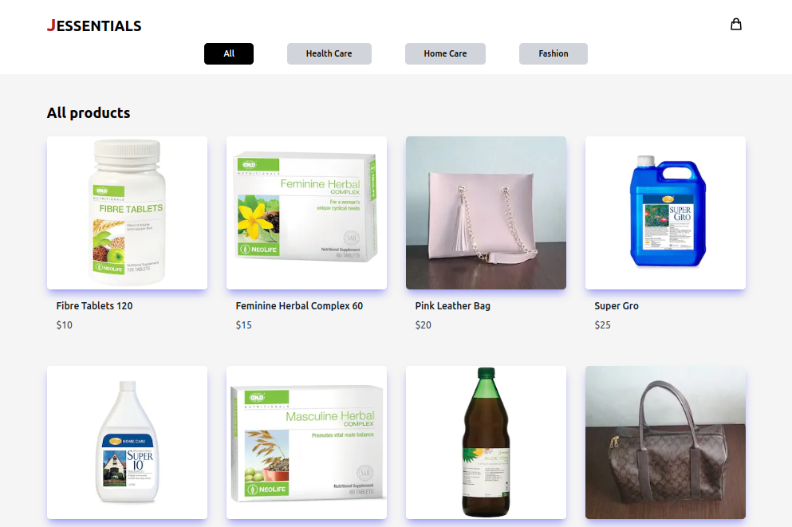
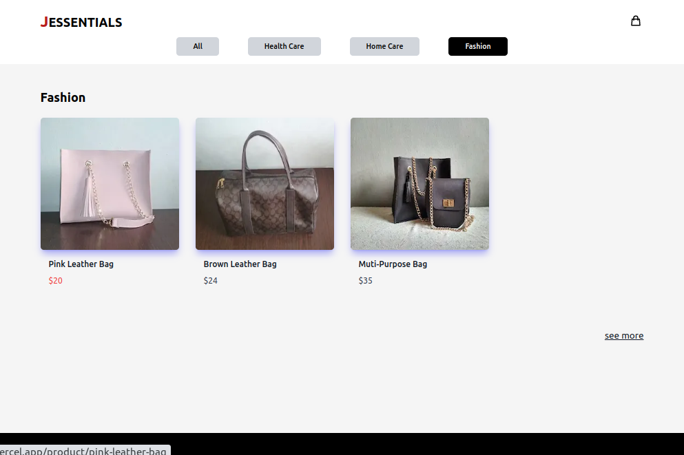
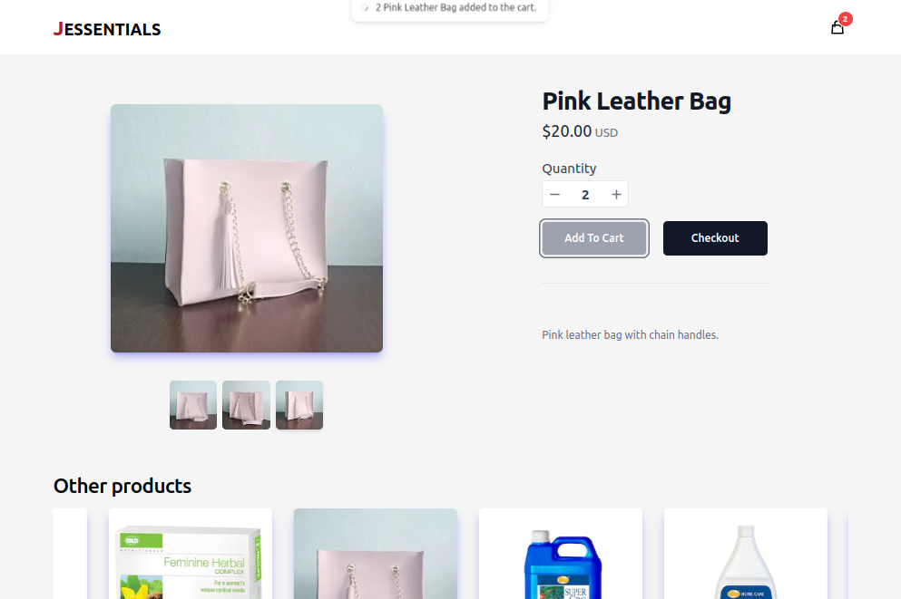
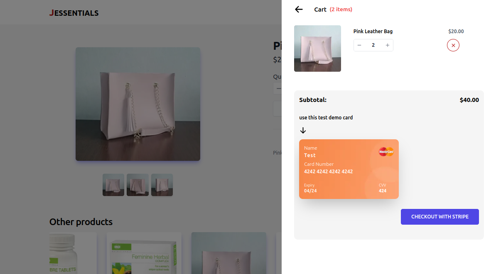
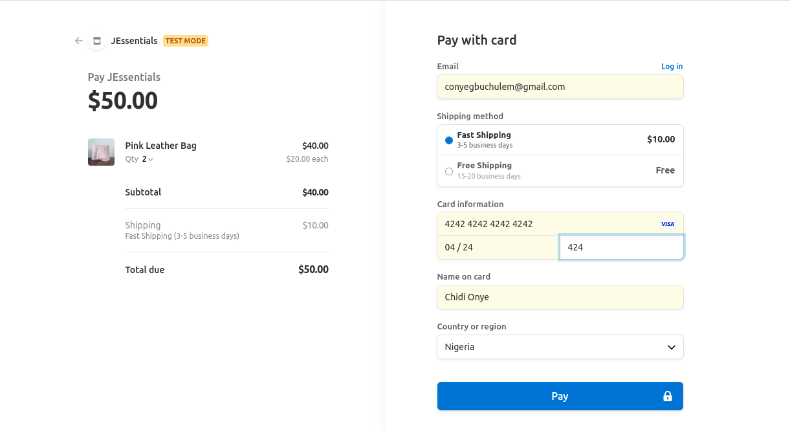

My client; JEssential is a third-party seller on large marketplaces but wishes to have her eCommerce website to increase profit margins and conversions. Having her website will help her diversify her online presence, drive additional sales, improve branding, lower cost per sale, and remove limitations, restrictions, and tough requirements from the large eCommerce marketplaces.

## Purpose and Goal

The purpose of this project is to build an eCommerce website for my client working with her to achieve the above-stated objectives.

## Design

Working with the client, we came up with this first design which I designed using Figma.

[More on Figma](https://www.figma.com/file/byy28WQ17cymDsF8AYRlpZ/Jessentials)

## Development

<u>Frontend:</u> **NextJS and TypeScript**: used to build the UI components, **Tailwind** for general styles, **React Query**: for managing server state and **React Context** for local state, **Eslint** for linting and **Prettier** for code formating.

<u>Backend:</u> **Sanity** to manage the ecommerce products and content experiences; **Stripe** to manage checkout and payment

<u>Deployment:</u> **Vercel**

[source code](https://jessentials.vercel.app/)

## Screenshots

1. Home page with all products in different categories.
   

2. A category page showing products in same category.
   

3. A product page showing selected item.
   

4. A product page showing selected item with cart opened on the side.
   

5. A stripe checkout page for selected item
   

## Takeaways

I have learned more about NextJS, Sanity and Stripe from working on this project. This project is still a work in progress and I have resolved to improve the following:

- write test (unit, integration and end-end tests).

- improve the UI , UX and accessibility.
