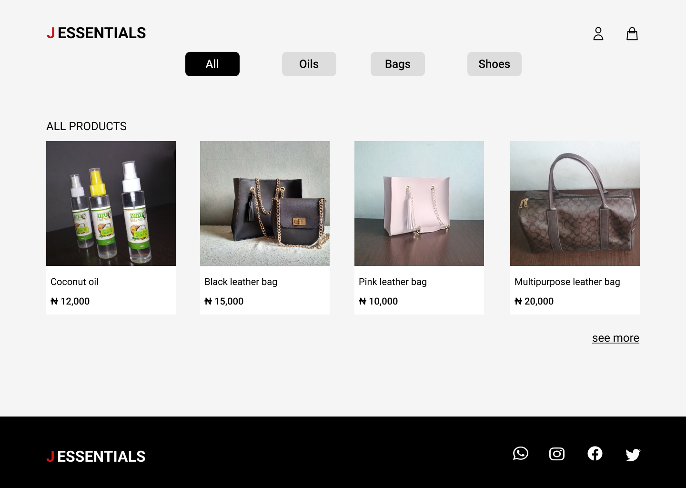

My client; JEssential is a third-party seller on large marketplaces but wishes to have her eCommerce website to increase profit margins and conversions. Having her website will help her diversify her online presence, drive additional sales, improve branding, lower cost per sale, and remove limitations, restrictions, and tough requirements from the large eCommerce marketplaces.

## Purpose and Goal

The purpose of this project is to build an eCommerce website for my client working with her to achieve the above-stated objectives.

## Design

Working with the client, we came up with this first design which I designed using Figma.

[More on Figma](https://www.figma.com/file/byy28WQ17cymDsF8AYRlpZ/Jessentials)

## Development (In progress)
