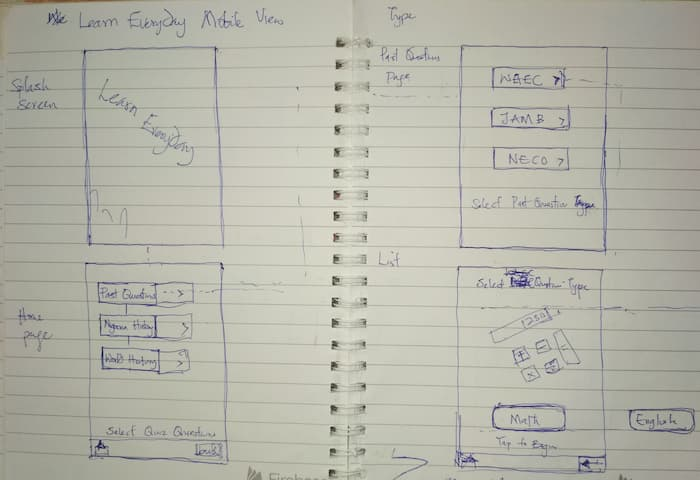
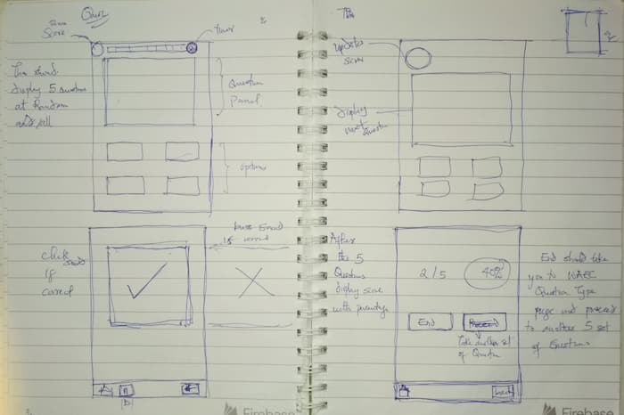
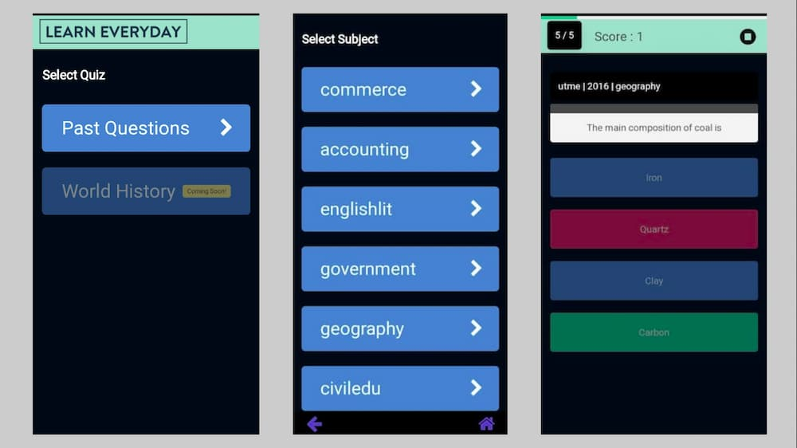

When COVID-19 struck, students in my home country Nigeria were preparing to take A-level examinations to graduate from secondary schools and enable them to gain admission into tertiary institutions. As we all went indoors and were bored out of our minds, I discovered that there was no easy and fun way to help these students continue to study for their examinations.

## Purpose and Goal

My goal is to build to fun educational quiz app to help these students practice for their examinations and <b>for free</b>.
Also, I wanted it to be accessible to students with slow internet service.

## Design

I gathered ideas from my favorite quiz apps: Quizizz, Kahoot, and Elevate. And did a hand sketch of the wireframes and user flow for the app.

## Development

<u>Frontend</u>: The frontend is built with React and TypeScript. Initially, most of the code was written in JavaScript but I switched to TypeScript because of its benefits especially with static typing and spotting bugs early. The app is also a progressive web app because I wanted it to be accessible to most students with slow internet service.

<u>Backend</u>: To access questions of major exams in Nigeria, I used the [ALOC Endpoints API](https://questions.aloc.ng/).

<u>Deployment</u>: Netlify was used.

[source code](https://github.com/chidexebere/learn-everyday)

## Results

These are a few screenshots of my first working prototype.

## Takeaways

I have learned a lot from working on this project; from improving my proficiency with React to learning design. Yeah, I have been learning product and UX design. This project is still a work in progress and I have resolved to do the following before my next prototype.

- carry out user research to understand fully my users' first.

- revamp the UI based on the user research since one of the goals is to make the app fun.

- do more testing with actual users.
