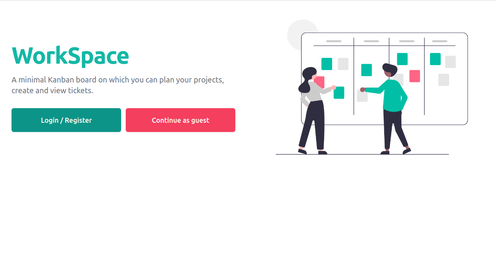
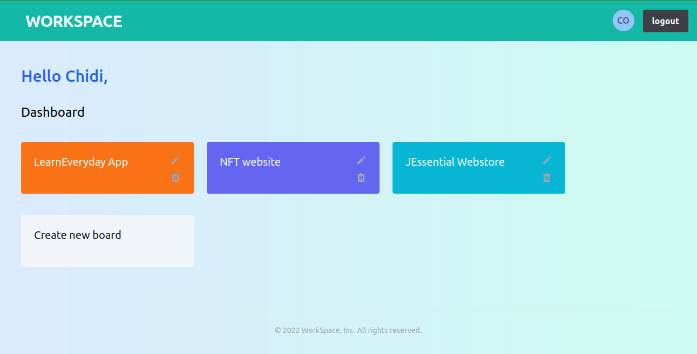
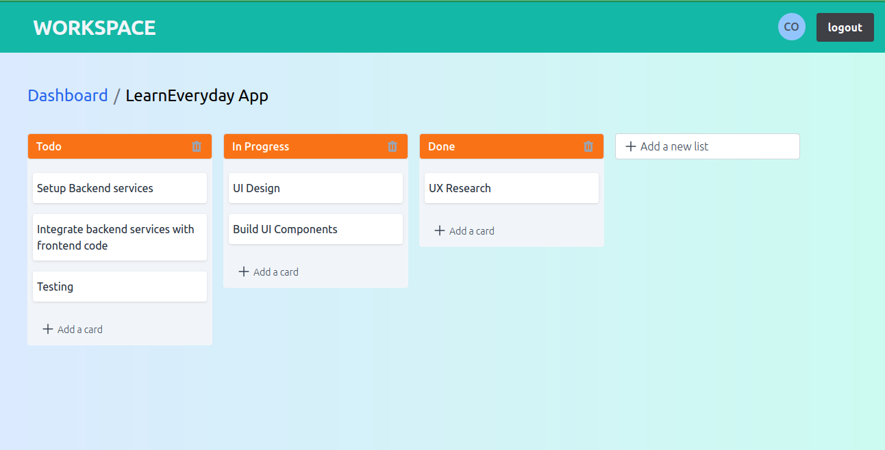

A simple Kanban board implementation used to plan personal and work projects.

## Features

- Users can sign in with Email, Google and as Guest.

- Add mutiple boards, lists and tickets.
- Reorder tickets on different lists.

## Development

<u>Frontend:</u> **React and TypeScript**: used to build the UI components, **Tailwind** for general styles, **Firebase UI** for sign-in UI, **React Query**: for managing server state and **React Context** for local state, **Eslint** for linting and **Prettier** for code formating.

<u>Backend:</u> **Firebase** for backend services; **Cloud Firestore** and **Firebase Authentication**

<u>Deployment:</u> **Firebase Hosting**

[source code](https://github.com/chidexebere/learn-everyday)

## Screenshots

1. Displays home page with signin buttons.
   

2. Displays signed in user with user boards.
   

3. Displays signed in user with each user board content including lists and tickets.
   

## Takeaways

I have learned more about firebase from working on this project; especially cloud firestore and firebase authentication. This project is still a work in progress and I have resolved to improve the following:

- write test (unit, integration and end-end tests).

- improve the UI , UX and accessibility.
